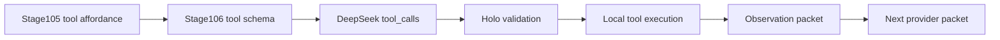

# Stage106 DeepSeek Tool Adapter

Stage106 turns provider tool-calling into a bounded Holo contract.

## Principle

DeepSeek v4-class models can propose tool calls, but Holo must keep subject
authority local:

- the provider receives only allowlisted tool schemas;
- the provider may propose `tool_calls`;
- Holo validates the tool name and JSON arguments;
- Holo executes tools locally, inside the WSL brain boundary;
- tool observations are compressed into the next Stage105 provider packet.

The provider is therefore an action proposer, not an executor.

## Current Adapter Surface

CLI:

```powershell
python -m holo_host stage106-deepseek-tool-adapter --query "查一下最新状态"
```

The command:

1. asks the current mind packet for the query;
2. runs Stage105 packet-stream planning;
3. converts Stage105 `tool_requests` into OpenAI/DeepSeek-compatible `tools`;
4. prints the provider payload and authority boundary.

Provider integration:

- `DeepSeekProvider` attaches `tools` and `tool_choice` only when the request
  metadata explicitly sets `enable_provider_tools=true`;
- returned `message.tool_calls` are parsed into result metadata;
- unknown tools and non-object arguments are marked rejected.

## Allowlist

`external_lookup`

- Purpose: request current external evidence before answering.
- Required argument: `query`.
- Status: provider-visible, Holo-executed later.

`memory_recall`

- Purpose: request local read-only Holo memory recall.
- Required argument: `query`.
- Status: provider-visible, WSL-only execution boundary.

## Loop Contract



Stage106 deliberately does not execute tools yet. It makes the model-tool
interface explicit and testable before the executor loop is attached.
